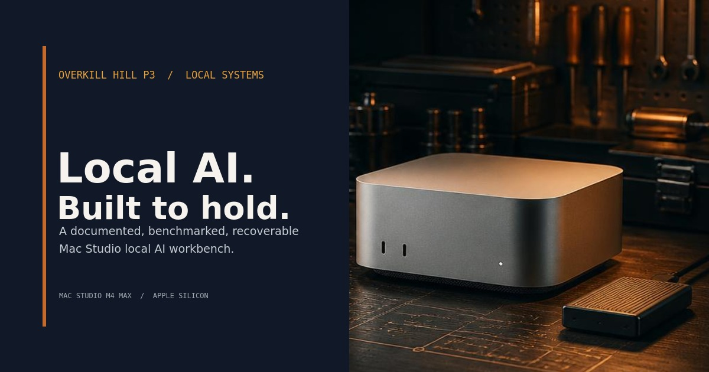
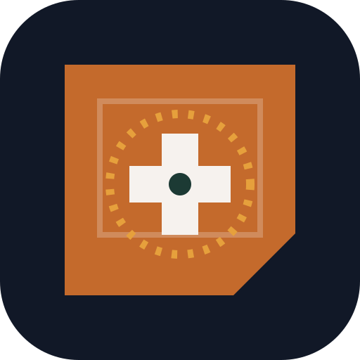

# Mac Studio Local AI Workbench

**A documented, benchmarked, and recoverable local AI workbench built on Apple Silicon.**

[](https://overkillhill.com/projects/mac-studio-local-ai-workbench/)

**[Explore the public project](https://overkillhill.com/projects/mac-studio-local-ai-workbench/)** · **[Read the September stack record](docs/19-reference-stack-2026-09.md)** · **[Run the documentation viewer](#run-the-documentation-viewer)**

Local AI. Built to hold.

One Mac Studio M4 Max. Local models, a chat front door, and a background agent named Larry. This is the operating record behind the machine: how the pieces fit, what the benchmarks actually showed, what survived a reboot, and what still needs work.

Part of **SHOAL / Workbench**, by [OverKill Hill P³](https://overkillhill.com/). A personal infrastructure case study and reference build, with public documentation you can explore and adapt.

## Inside the workbench

- **Inference with a purpose.** Ollama serves local models to chat and agents. LM Studio provides a separate model workspace, with direct `mlx-lm` experiments documented alongside it.
- **Two ways to work.** Open WebUI is the conversational front door. OpenClaw, running as Larry, supplies the background agent layer. SearXNG provides local search infrastructure.
- **Storage with a plan.** Model files and caches live on external NVMe storage, with documented layouts, manifests, and recovery assets. The recorded machine has 36 GB of unified memory, so model size and context budgets matter.
- **Results you can inspect.** Fixed benchmark prompts, recorded outputs, architecture diagrams, and dated operating notes make the decisions traceable.
- **Maintenance that leaves a record.** Weekly release monitoring, read-only version capture, and validation checks support deliberate upgrades and rollback planning.

The public site tells the build story. The React/Vite viewer in this repository presents 27 selected Markdown documents. It is a documentation interface; it does not control the Mac or report live host health.

## Start exploring

| If you want to… | Start here |
|---|---|
| See the build story | [Public project page](https://overkillhill.com/projects/mac-studio-local-ai-workbench/) · [Build journey](docs/01-build-journey.md) |
| Understand the recorded September setup | [Reference stack, September 25, 2026](docs/19-reference-stack-2026-09.md) |
| Follow the system design | [Architecture diagrams](docs/12-architecture-diagrams.md) · [Storage architecture](docs/02-storage-architecture.md) |
| Compare model behavior | [Benchmark results](docs/05-benchmark-results.md) · [Benchmark prompts](benchmarks/smoke-test-prompts.md) · [Model inventory](docs/04-model-inventory.md) |
| Meet Larry | [Agent documentation](docs/10-openclaw-larry-agent.md) · [September agent decisions](docs/19-reference-stack-2026-09.md#design-decisions-and-why) |
| Adapt the pattern | [Build your own local AI](docs/11-build-your-own-local-ai.md) · [Reusable templates](templates/) |
| See what comes next | [RAG roadmap](docs/07-rag-roadmap.md) · [Local portal and HTTPS plan](docs/local-web-portal-https.md) |

## What the evidence says

Reviewed against repository records on **September 27, 2026**. These are dated observations, not a fresh audit of the workstation.

| Milestone | Recorded result |
|---|---|
| **May 2026: baseline** | Build, storage normalization, initial benchmarks, hardening, and local archive completed. Larry was documented online on May 28. [Build record](docs/01-build-journey.md) |
| **May 30, 2026: strict benchmark** | Six Ollama models, five prompts each. `gemma3:12b` and `gemma3:27b` scored 5/5. No outright failures across the six models; formatting issues remained in other outputs. [Results and scoring](docs/05-benchmark-results.md) |
| **September 24–25, 2026: reference stack** | The record reports services recovering after a cold reboot and login, cited web-search responses, and local memory embeddings. It records `gpt-oss:20b` as Larry's primary model, superseding the May selection. [Evidence and known limits](docs/19-reference-stack-2026-09.md) |
| **September 26, 2026: documentation viewer** | The recovered viewer renders the public Markdown collection, with desktop and mobile smoke coverage. [Published document catalog](src/docsCatalog.js) · [Browser checks](tests/pages-smoke.spec.js) |
| **Still open** | Qdrant is documented as running. End-to-end RAG ingestion, retrieval, and citation remain unverified; the local portal remains planned. [Readiness assessment](reports/openclaw-related-runtime-readiness-audit-2026-08-02.md) · [Portal plan](docs/local-web-portal-https.md) |

A five-prompt benchmark is evidence about those prompts. A running service is evidence about that service. Neither settles every question about the system.

## How the pieces fit

```text
Mac Studio M4 Max + external NVMe storage
  |
  +-- Inference       Ollama / LM Studio / direct mlx-lm
  +-- Conversation    Open WebUI
  +-- Agent           OpenClaw / Larry
  +-- Search          SearXNG
  +-- Vector storage  Qdrant (documented running)
  |                   End-to-end RAG remains unverified
  +-- Operations      Manifests, benchmarks, checks, recovery records
```

The [September reference stack](docs/19-reference-stack-2026-09.md) explains model roles, memory limits, startup behavior, and access boundaries. The [storage guide](docs/02-storage-architecture.md) explains the external-volume layout. For portable examples, use `/Volumes/<external-ai-volume>/07_Local_LLMs/` and adapt it to your own machine.

## Run the documentation viewer

With **Node.js 24** installed, from the repository root:

```bash
npm ci
npm run dev
```

Open **[the local viewer](http://localhost:5000/)** once the development server is running.

Useful checks:

```bash
npm run check                    # production build and generated asset links
npx playwright install chromium  # install the browser used by smoke checks
npm run test:smoke                # desktop and mobile routes
```

Markdown remains the source of truth. [`src/docsCatalog.js`](src/docsCatalog.js) selects the public documents, and [`src/`](src/) renders them. The verified public destination is the [OverKill Hill project page](https://overkillhill.com/projects/mac-studio-local-ai-workbench/); this repository does not currently publish the viewer through GitHub Pages.

## Visual identity and sharing

Copper, midnight blue, and a workbench built to last. The cover, social card, and compact icons carry the same identity from the README into the documentation viewer.

<p>
  <a href="public/brand-mark.svg"></a>
  &nbsp;
  <a href="public/apple-touch-icon.png"></a>
  &nbsp;
  <a href="public/workbench-avatar-512.png"></a>
</p>

| Surface | Ready-to-use asset or source |
|---|---|
| README hero and social sharing | [1200 × 630 social preview](public/workbench-social-preview.jpg) |
| Project covers and avatars | [Cover artwork](public/workbench-cover-base.jpg) · [Replit project cover](public/replit-project-cover.jpg) · [512 × 512 avatar](public/workbench-avatar-512.png) |
| Browser tabs and bookmarks | [SVG brand mark](public/brand-mark.svg) · [32 px favicon](public/favicon-32.png) · [16 px favicon](public/favicon-16.png) |
| Apple home-screen shortcut | [180 × 180 touch icon](public/apple-touch-icon.png) |
| Safari pinned tabs | [Monochrome pinned-tab mask](public/safari-pinned-tab.svg), with a copper tint declared in the page head |
| App and home-screen presentation | [192 px icon](public/pwa-192.png) · [512 px icon](public/pwa-512.png) · [Web app manifest](public/site.webmanifest) |
| Page titles and share previews | [`index.html`](index.html): description, canonical URL, theme color, Open Graph, and Twitter/X large-image card tags, including image dimensions and alt text |

The viewer's page head references the social card, tab icons, touch icon, pinned-tab mask, and manifest. The manifest supplies its name, colors, icons, and launch presentation; it does not establish offline support. GitHub repository social previews are configured separately in repository settings using the social image above. The OverKill Hill project page is maintained in its own site repository.

## Maintain and recover

The [technology comparison](reports/technology-update-report.md) links recorded versions to upstream release sources and identifies unknowns. The [maintenance policy](docs/15-technology-version-management.md) covers weekly monitoring, Dependabot updates for GitHub Actions, upgrade checks, and rollback. Recorded host versions need verification on the Mac before an upgrade decision.

Recovery starts with the [manifests](manifests/), [sanitized configuration example](config/env.example), and [repository-aware scripts](scripts/). The current restore and verification scripts need their CRLF line endings corrected before use; see [the script guidance](AGENTS.md#verified-and-available-operations). The copies in [`mac-studio-setup/`](mac-studio-setup/) belong to the dated baseline. Restore operations change the host and should follow a backup or checkpoint.

<details>
<summary><strong>Repository map and safe synchronization</strong></summary>

| Location | What belongs here |
|---|---|
| [`docs/`](docs/) | Build story, architecture, toolchain, model roles, agent guides, and dated operating records |
| [`benchmarks/`](benchmarks/) | Prompt suites and recorded comparisons |
| [`src/`](src/) · [`public/`](public/) | Static documentation viewer and branding assets |
| [`manifests/`](manifests/) · [`config/`](config/) | Package and model inventories, sanitized examples, technology tracking inputs |
| [`scripts/`](scripts/) · [`tests/`](tests/) | Maintenance, recovery, and validation |
| [`reports/`](reports/) · [`templates/`](templates/) | Evidence reports and reusable working documents |
| [`mac-studio-setup/`](mac-studio-setup/) | Preserved baseline snapshot |
| [`context/threads/`](context/threads/) | Sanitized continuity extracts |

Start synchronization with `git status --short --branch` and `git fetch origin`. From a clean, non-divergent branch, use `git pull --ff-only`. Enable the publication guard with `git config core.hooksPath .githooks` and set `git config pull.ff only` once per clone. After a public-history redaction, preserve private recovery material and review unique files on a fresh branch from `origin/main`; do not merge old unsanitized history back into `main`. See [AGENTS.md](AGENTS.md) for the full procedure.

</details>

## Public by design

This repository holds the durable, sanitized artifacts: documentation, benchmarks, manifests, templates, and recovery procedures. Model binaries, caches, credentials, raw connector configuration, private workspace links, and machine backups stay outside it. See the [publication boundary](docs/publication-boundary.md).

Created and maintained by **Jamie / [OverKill Hill P³](https://overkillhill.com/)**. Related work: [SHOAL AI Server](https://github.com/OKHP3/shoal-ai-server) and [Infusing a Soul](https://github.com/OKHP3/infusing-a-soul).

For the project guide and collaboration rules, begin with [AGENTS.md](AGENTS.md).

---

Built locally. Measured deliberately. Documented for the next person, including future me.
