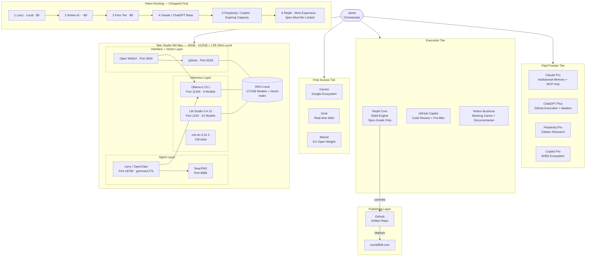
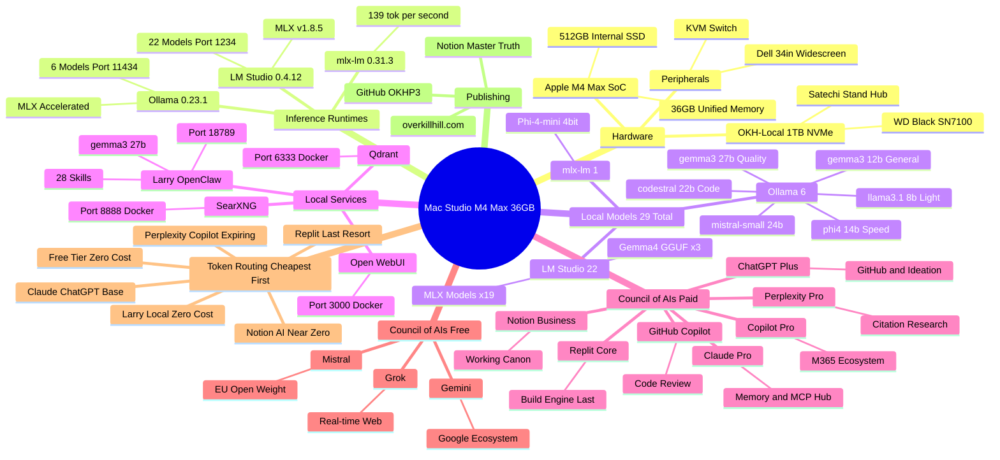
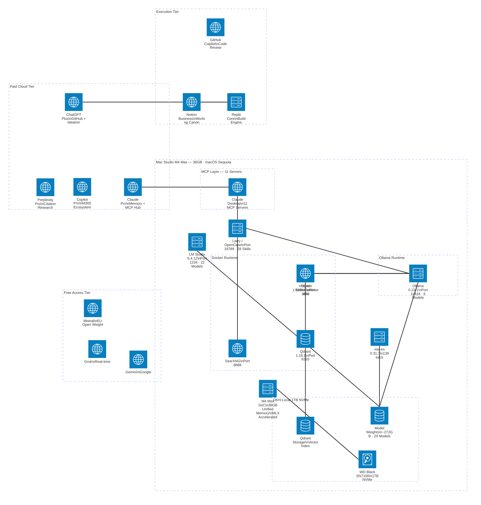

# Architecture Diagrams

Three views of the same system. Each diagram tells a different story.

Validated in Mermaid Chart Enterprise — 2026-05-30.

---

## Diagram 1 — Flowchart

How work moves through the system. Jamie at the top, the full Council of AIs across paid frontier, execution, and free tiers, the local Mac Studio stack in the middle, and the publishing pipeline at the bottom. Token routing hierarchy shown explicitly — Larry at zero cost, Replit as the last resort.

---

## Diagram 2 — Mind Map

The full scope of the stack as a mind map. Everything radiates outward from the Mac Studio M4 Max core — hardware, inference runtimes, 29 local models, running services, the complete Council of AIs (paid and free tiers), token routing hierarchy, and publishing layer.

---

## Diagram 3 — Architecture (C4-style)

Structural view using Mermaid's `architecture-beta` format. Shows physical and logical groupings as bounded containers — OKH-Local NVMe, Docker Runtime, Ollama Runtime, MCP Layer, and all four cloud tiers (paid, execution, free access) — with services connected by dependency lines.

Note: `architecture-beta` group labels use square brackets, not parentheses.

---

## Notes

- All diagrams validated in Mermaid Chart Enterprise, 2026-05-30
- `architecture-beta` group labels require square brackets (`["label"]`), not parentheses
- Flowchart and mind map use standard syntax compatible with all Mermaid renderers
- Full Council of AIs reflected: paid frontier (Claude Pro, ChatGPT Plus, Perplexity Pro, Copilot Pro), execution tier (Replit Core, GitHub Copilot, Notion Business), free access (Gemini, Grok, Mistral), and local zero-cost (Larry / OpenClaw)
