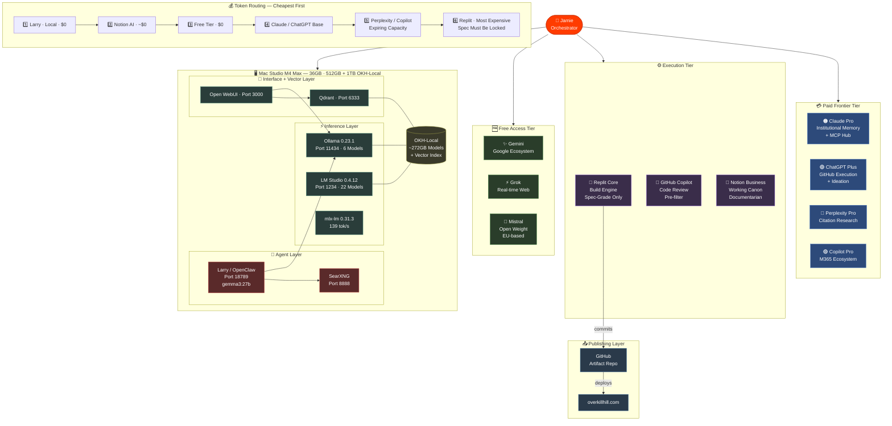

# Mac Studio Local AI Workbench — Flowchart

Shows how work moves through the full system: from Jamie as orchestrator, through the tiered Council of AIs, into the local Mac Studio stack, and out through the publishing pipeline.

