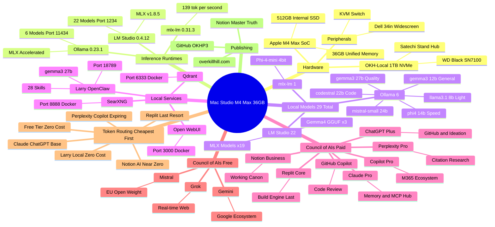

# Mac Studio Local AI Workbench — Mind Map

Shows how everything radiates outward from the Mac Studio M4 Max core — hardware, runtimes, models, services, the full Council of AIs (paid, execution, and free tiers), token routing hierarchy, and publishing surfaces.

