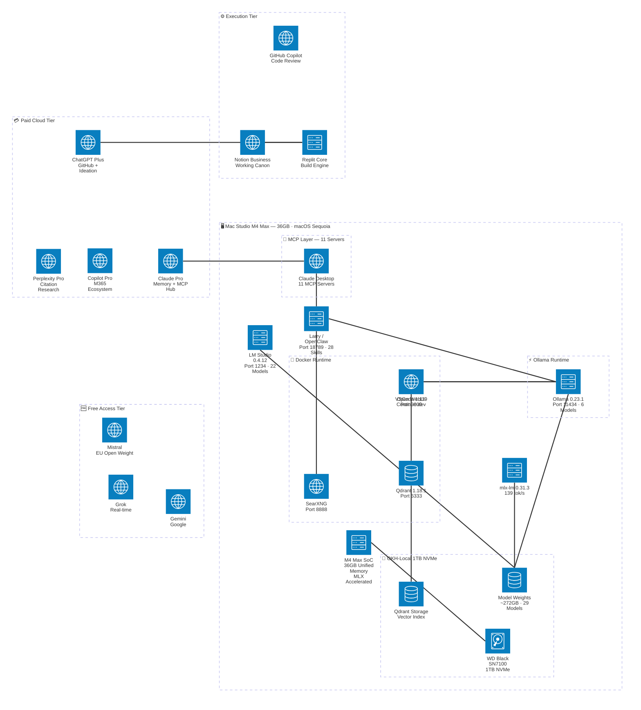

# Mac Studio Local AI Workbench — System Architecture

C4-style structural view using Mermaid architecture-beta format. Shows physical and logical groupings — storage, Docker runtime, Ollama runtime, MCP layer — alongside the full Council of AIs cloud tiers, with dependency connections between services.

